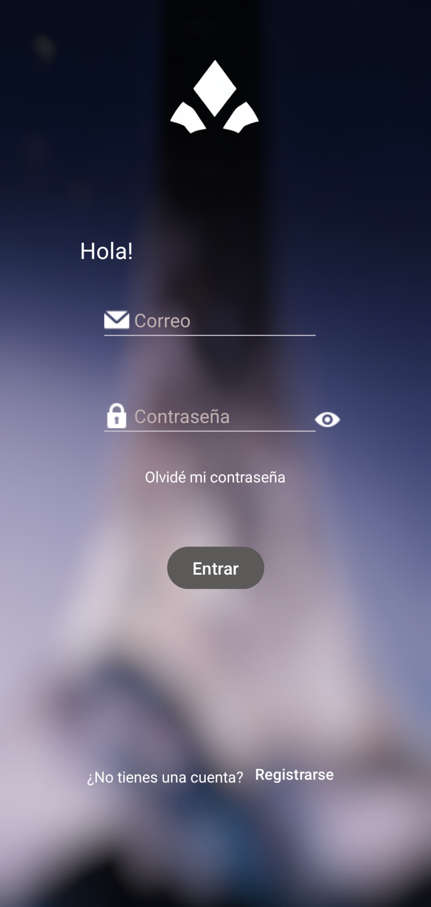
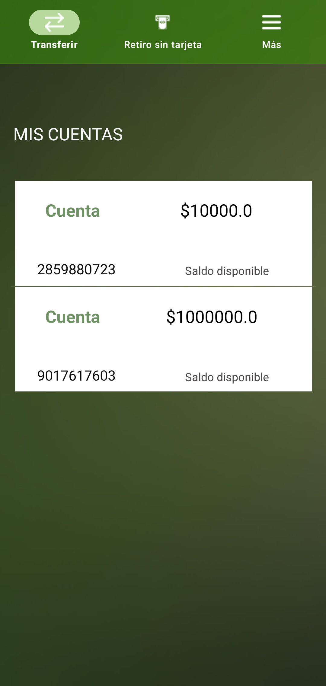

# AppBancaria

Aplicación Android desarrollada como proyecto final universitario.

> **Aviso:** este proyecto es sencillo, tiene fines educativos y no representa una aplicación bancaria real. No debe utilizarse en un entorno de producción.

## Descripción

La aplicación simula algunas funciones básicas de una app bancaria utilizando información almacenada localmente en el dispositivo.

## Capturas de pantalla

<table align="center">
  <tr>
    <td align="center">
      <br>
      <em>Imagen 1. Inicio de sesión</em>
    </td>
    <td align="center">
      <br>
      <em>Imagen 2. Pantalla principal</em>
    </td>
  </tr>
</table>

Incluye pantallas para:

- Registro e inicio de sesión.
- Consulta de cuentas y saldos.
- Transferencias.
- Retiro sin tarjeta.
- Recargas de tiempo aire.
- Pago de servicios.
- Confirmaciones visuales de las operaciones.

## Tecnologías

- Kotlin.
- Android Studio.
- AndroidX y Material Components.
- SQLite local.

## Ejecutar el proyecto

1. Abre el proyecto en Android Studio.
2. Espera a que Gradle sincronice las dependencias.
3. Ejecuta la aplicación en un emulador o dispositivo Android.

También puedes compilarlo desde Windows con:

```powershell
.\gradlew.bat test
.\gradlew.bat assembleDebug
```

El APK de depuración se genera en `app/build/outputs/apk/debug/app-debug.apk`.

## ¿Qué se puede aprender?

Este proyecto puede servir para practicar:

- Activities e Intents.
- Diseños XML.
- Formularios y validaciones.
- ListViews y adaptadores.
- Navegación entre pantallas.
- Operaciones básicas con SQLite.

## Estado del proyecto

Proyecto universitario finalizado y publicado como material de aprendizaje.
